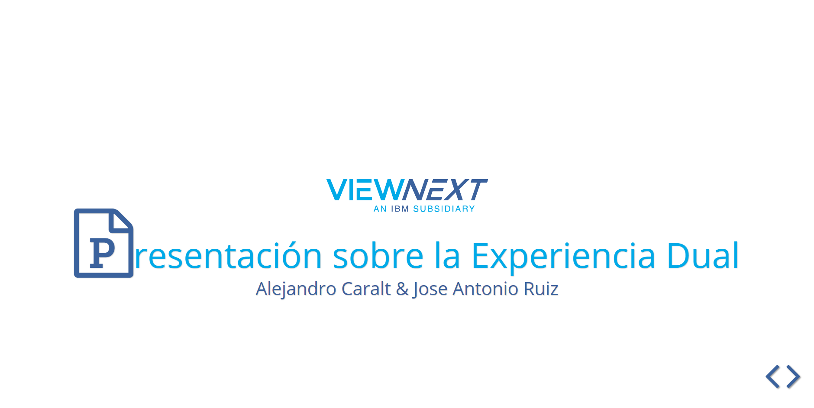
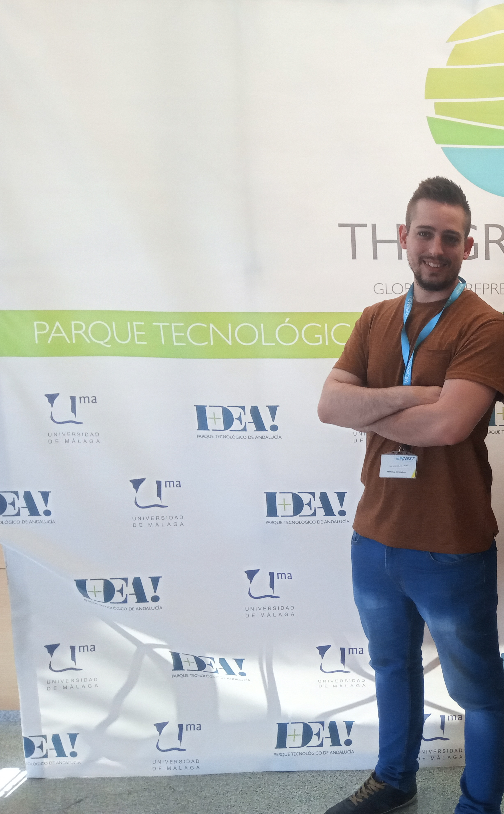

# Viewnext-JoseAntonioRuizMostazo
Presentación en chirimoya sobre la experiencia vivida con la formación dual en la empresa de viewnext

[Link para la Presentación](https://cdn.rawgit.com/joseantonioruizmostazo/Viewnext-JoseAntonioRuizMostazo/965ee622/dist/Presentacion/index.html)

## Opinión personal
Mi experiencia en la dual ha sido muy positiva, superando cualquier expectativa que pudiese llevar y que me pudiesen transmitir tanto las empresas como compañeros de 2º el día de la presentación de empresas, dar las gracias a los profesores que me asesoraron recomendándome Viewnext, haciéndome saber que era la empresa adecuada para mí, donde iba a estar más arropado e iba a aprender más y pienso que no se han equivocado pues así ha sido,  sobre todo por mi gran compañero Alejandro Caralt, que me ha ayudado mucho, y por el resto, tanto compañeros como trabajadores de la empresa.
Dar las gracias al elenco de profesores que hace esto posible y a la empresa.
Decir que salgo muy contento en general, con la empresa y con el tutor que nos ha tocado, pues ha sabido gestionar muy bien nuestro aprendizaje con el proyecto que nos ha asignado.
Con muchas ganas de volver y aprender más cada día.

